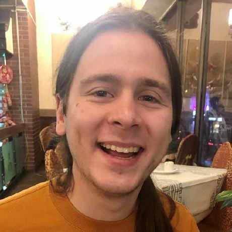

```{r setup, include=FALSE}
knitr::opts_chunk$set(echo = FALSE)
```


### Taofeek Alao

### Sunandan Chakraborty

### Palak Jain

### Sawyer Lehman

### Jack VanSchaik

<div class="wrapper">
<div>
</img>
</div>
<div>
Jack is a Data Science PhD student in the School of Informatics and Computing at IUPUI. He is interested in developing natural language processing (NLP) methods that facilitate health research. 

* [GitHub](https://github.com/jackvanschaik)
* [LinkedIn](https://www.linkedin.com/in/jack-vanschaik/)
* [Google Scholar](https://scholar.google.com/citations?user=QmuT_t0AAAAJ&hl=en&oi=ao)
</div>
</div>

